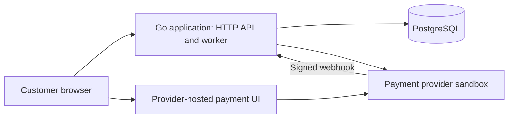

# Checkout learning project: design for review

Date: 2026-10-08
Status: accepted starting design for the new project; detailed contracts and implementation plan still require review.

## 1. Purpose and scope

Build a small checkout application whose correctness can be explained and demonstrated under concurrency, duplicate requests, lost responses, and process crashes. Learn Go and PostgreSQL deeply before adding operational systems. Success is reproducible evidence and an explanation of tradeoffs, not a technology count or a production-scale claim.

The user requested architecture and documentation before coding, minimal complexity, real checkout/payment integration, and libraries or official examples for established mechanisms.

Defaults below are the starting design choices for the new project, not descriptions of existing AtlasPay behavior. They may be revised while finalizing detailed contracts.

### Initial product

- One store, one configured currency, and one SKU per order; quantity is a positive integer.
- An authenticated customer reads products, submits checkout, completes payment through provider-hosted UI, and reads their order status.
- Prices and totals come from server-side catalog data, never from client input.
- Customers can read only their own orders. Provider callbacks authenticate through signature verification, independently of customer authentication.
- A small operator command reports and retries recoverable work; it is not a public admin API.
- Use a real payment-provider sandbox for integration and a controllable fake for deterministic tests. No live money or card data storage.

### Exclusions

Multi-item baskets, taxes, shipping, discounts, subscriptions, partial refunds, multiple currencies, multiple payment providers, customer cancellation, and accounting ledgers are outside the first version. Refunds are supported only as recovery for a successful payment that cannot be fulfilled. General refund administration is excluded.

Redis, Kafka, Kubernetes, service extraction, a gateway, and a custom authentication platform are not initial requirements. Authentication uses managed Auth0 access tokens; the provider is Stripe sandbox hosted Checkout. See integration-decisions.md for contracts and account prerequisites.

## 2. Architecture and ownership



One Go executable runs the HTTP server and a background worker. Docker Compose runs the application and PostgreSQL. Later, the same worker may run as a separate process without changing business rules.

| Boundary | Owns | Does not own |
| --- | --- | --- |
| Checkout | Order lifecycle, checkout request idempotency, cross-module decisions | Provider transport |
| Inventory | Stock and reservation transitions | Payment decisions |
| Payment | Attempts, provider identifiers, webhook interpretation, refund recovery | Order confirmation policy |
| HTTP API | Authentication integration, ownership checks, validation, response mapping | Business transitions |
| Worker | Claims, scheduling, retry execution | Business truth |
| PostgreSQL | Authoritative local state, constraints, atomic local writes | Provider-side payment outcome |
| Provider | External payment and refund outcome | Local stock and order state |

HTTP handlers call application operations. Business operations depend on narrow interfaces only where external I/O or a meaningful test boundary requires one. Avoid generic repositories, a service framework, and one-interface-per-struct conventions.

## 3. Correctness invariants

| ID | Invariant | Enforcement and planned proof |
| --- | --- | --- |
| I1 | Available stock is never negative | Atomic conditional stock update and database constraint; concurrent buyers test |
| I2 | Same customer, checkout key, and request produce one order; conflicting reuse is rejected | Unique customer/key pair and stored request fingerprint; concurrency and payload-conflict tests |
| I3 | Retries of one logical payment attempt reuse one provider operation identity | Persist identity before I/O; provider idempotency key reused across retries; lost-response test |
| I4 | Confirmed orders have established payment success and a consumed reservation | Guarded transition and one local transaction; late callback and duplicate processing tests |
| I5 | Reservations are consumed or released at most once | Conditional state transitions in transactions; repeated release/consume tests |
| I6 | Accepted unfinished work survives restart | Order, reservation, attempt, and task committed atomically; restart test |
| I7 | Timeout alone never establishes payment failure | Explicit unknown state and reconciliation; provider-success/response-loss test |
| I8 | One provider event cannot apply the same local business transition twice | Durable event deduplication and business-state guards in one transaction; replay test |
| I9 | Customers cannot access another customer's order or replay key | Owner-scoped reads and keys; authorization tests |
| I10 | Money has exact representation | Integer minor units, currency recorded, checked arithmetic, positive quantity and amount bounds |

I3 concerns one logical attempt, not an unlimited exactly-once guarantee. Provider idempotency retention and retry semantics must be documented when selecting the provider. If safe retry identity can no longer be established, reconcile or require operator action rather than creating a new charge blindly.

## 4. Proposed durable records

- Products: SKU, price in minor units, currency, available stock. An order stores the price snapshot.
- Orders: customer, checkout key, request fingerprint, SKU, quantity, amount, currency, lifecycle state, timestamps.
- Reservations: order, quantity, expiry, state. One reservation per order in this version.
- Payment attempts: order, stable operation key, provider object ID when known, payment state, refund operation identity, refund state. One logical payment attempt per order initially.
- Provider events: provider event ID, relevant object ID, receipt and processing state. Store only necessary fields; define retention before implementation.
- Work items: operation type, entity ID, due time, attempts, lease token/expiry, last classified error, status. Ensure one active task per logical operation.

Every local mutation that requires later external work must also persist that work in the same transaction. Do not hold database transactions open across provider calls. Use database time for reservation expiry and leases. Workers must guard updates with their claim token; external effects still require idempotency because lease expiry cannot prevent all overlapping execution.

Detailed schema/transactions, proposed API payloads, managed authentication and provider rules are specified in data-model.md, api-contract.md and integration-decisions.md. These define the new application, not existing AtlasPay endpoints.

## 5. State model

Order, reservation, and payment states are separate. A single status cannot capture an externally successful payment whose stock was released.

### Order states

| State | Meaning | Allowed next states |
| --- | --- | --- |
| pending | Stock reserved; payment not yet established | confirmed, failed, recovery_required |
| confirmed | Payment succeeded and reserved stock was consumed | Terminal in this scope |
| failed | Fulfillment ended; stock released; late payment may still require recovery | recovery_required |
| recovery_required | Successful external payment cannot be fulfilled; refund is pending or needs intervention | refunded |
| refunded | Recovery refund established with provider | Terminal in this scope |

Operator attention is a work/recovery condition, not a claim that the financial operation failed. A pending order may require attention while its payment outcome remains unknown.

### Reservation states

| Transition | Preconditions | Local action |
| --- | --- | --- |
| create held | Enough available stock | Decrement available stock and create reservation atomically |
| held -> consumed | Payment success established; order pending; reservation not expired | Confirm order atomically; no second stock decrement |
| held -> released | Definitive payment failure, or reservation expiry | Restore available stock once; mark order failed; persist cancellation/reconciliation work if necessary |

Consumed and released reservations do not return to held. Proposed reservation duration: 15 minutes, configurable. Webhook processing and expiry must lock/guard the same local records so their decisions serialize. Success observed after the deadline follows refund recovery even if the expiry worker has not run yet.

### Payment and refund states

Payment states: not_started, pending, unknown, succeeded, failed, canceled. Refund states: none, pending, unknown, succeeded, failed, canceled. Failed/canceled refunds require operator review while the order remains recovery_required.

- not_started becomes pending after provider object creation is established.
- A transport ambiguity becomes unknown; reconciliation can establish pending, succeeded, failed, or canceled.
- pending may become succeeded, failed, canceled, or unknown after an ambiguous operation.
- A provider-specific decline is terminal only if the provider contract makes it terminal for this attempt. Otherwise it remains pending until reconciliation/cancellation settles it.
- Late or out-of-order events cannot downgrade established success. When event ordering is insufficient, retrieve current provider state.
- Refunds reuse a separate stable operation identity; ambiguous refunds are reconciled just like payments.
- Provider success after reservation release leads to recovery_required and durable refund work. Provider-confirmed refund leads to refunded.

## 6. Checkout and recovery sequences

1. Validate authentication, request bounds, and checkout key. Resolve repeated keys before reserving again.
2. In one local transaction, snapshot price, reserve stock, create pending order/payment attempt, and persist provider-creation work. Insufficient stock leaves no partial order/reservation.
3. Return the durable order identifier and current state. Payment setup may still be pending; the client can fetch status and obtain the hosted payment link once ready.
4. Worker claims creation work and calls the provider with the stored operation identity outside the transaction.
5. Persist the result conditionally. If the response is lost, retain uncertainty and schedule reconciliation. Never generate a replacement identity to bypass uncertainty.
6. Verify a webhook signature and transactionally store its receipt plus processing work before acknowledging it. Invalid signatures are rejected; unavailable durable storage must not receive a successful acknowledgement.
7. Process the event against guarded states. Confirm payment and consume an eligible reservation atomically, or schedule refund recovery if fulfillment is no longer possible.
8. A reconciliation sweep discovers overdue/unknown payment work even if callbacks never arrive. An expiry sweep releases reservations and schedules provider cancellation/reconciliation as appropriate.

Browser redirects are navigation hints, not authoritative payment confirmation.

## 7. Failure matrix and acceptance experiments

| Experiment | Required result |
| --- | --- |
| Many buyers compete for last unit | At most one held/consumed reservation; stock nonnegative |
| Concurrent duplicate checkout requests | One order and one reservation; conflicting payload rejected |
| Provider succeeds but response is lost | No replacement charge; unknown outcome eventually reconciled |
| Webhook duplicated or reordered | No duplicate effects or downgrade of established success |
| App crashes after local commit, before provider call | Durable work resumes after restart |
| Worker crashes after provider success, before local result | Stable identity and reconciliation recover the same operation |
| Two workers overlap after lease expiry | Guarded local writes; no duplicate charge/refund |
| Payment success races reservation expiry | Either fulfilled once or released once with refund recovery |
| Provider unreachable beyond retry budget | Work discoverable with error and operator-action condition; no fabricated failure |
| Refund response lost | Refund remains unknown until reconciled; no new refund identity |
| Another customer requests an order | No order data disclosed |

Use real PostgreSQL for transactions and concurrency. Use a deterministic fake provider for crash timing and a separate sandbox integration suite for real API/webhook behavior. Do not require the real provider to reproduce every fault in CI.

Retries apply only to classified retryable errors, with bounded attempts, backoff and jitter. Reconciliation has its own schedule and visibility; exhausting automatic attempts does not erase work. Exact intervals, budgets and operator commands are specified in recovery-runbook.md; HTTP errors are specified in api-contract.md.

Measure accepted orders separately from completed checkouts. Useful initial signals: pending-work age, unknown payments, reservation expirations, recovery-required orders, retry outcomes, and completion latency. Avoid raw customer/order identifiers as metric labels.

## 8. Proposed implementation folder map

```text
cmd/checkout/          application startup and dependency wiring
internal/checkout/    order lifecycle and cross-module coordination
internal/inventory/   stock and reservation operations
internal/payment/     payment state and provider adapter
internal/httpapi/     transport, authentication integration, ownership checks
internal/worker/      claims, scheduling, retries, reconciliation triggers
internal/database/    connections and migration execution
migrations/           ordered database migrations
tests/integration/    scenarios crossing module boundaries
deployments/compose/  local runtime
docs/                 design, decisions, experiments
```

This map is for the proposed fresh implementation. It is not an instruction to restructure existing AtlasPay. Unit tests live beside the code. Persistence queries live with the owning module. Add frontend assets only when the minimal browser checkout is designed; no frontend framework is required by this specification.

## 9. Engineering policy and technology gates

Use the Go standard library where sufficient. Evaluate maintained libraries for PostgreSQL access, migrations, payment-provider SDK, and authentication integration using official documentation and small official examples. Select versions and record reasons before installing dependencies. Do not copy a large starter template or build custom cryptography, tokens, connection pools, or migration machinery.

Required conventions: explicit errors, context/timeouts for I/O, graceful shutdown, configuration validation, narrow ownership, versioned migrations, secret-free logs, and failure-focused tests. Template code must be understood, licensed appropriately, and tested in this application.

- Redis gate: a measured read problem and an explicit staleness/invalidation policy. Never make cached stock authoritative.
- Kafka gate: a deliberate experiment about event delivery/replay or independent consumers. Document duplicate handling and delivery guarantees before adding it.
- Kubernetes gate: a separate deployment-learning objective after application correctness and recovery are demonstrated.

## 10. Detailed contracts and execution

The documentation package is complete in api-contract.md, data-model.md, integration-decisions.md, recovery-runbook.md, engineering-guide.md and implementation-plan.md. review-record.md provides traceability and verification boundaries.

The starting decisions are a 15-minute reservation, one logical hosted payment session per order, managed customer identity, and refund recovery for late success after stock release. External account access is required for real sandbox/identity acceptance. No application has been implemented by this documentation work.
